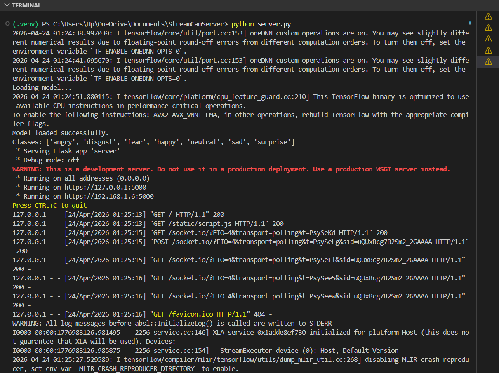
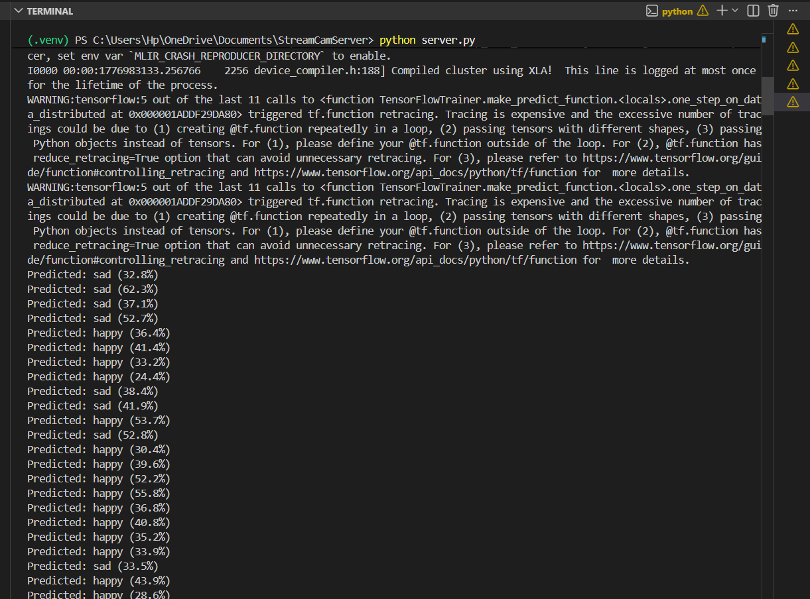

# Emotion Detection — Real-time Camera Stream Application

[](https://github.com/MohamedEshmawy/StreamCamServer/actions/workflows/docker-publish.yml)

This project extends the original WebSocket Secure (WSS) camera streaming application by adding a **real-time emotion detection system** powered by deep learning. The app captures live webcam frames, detects faces, and classifies facial expressions into 7 emotion categories using Transfer Learning models trained on the FER2013 dataset.

---

## **What Was Added**

### Emotion Detection Module
- Integrated a pre-trained **MobileNetV2** model (Transfer Learning) for real-time facial emotion classification.
- Added **face detection** using OpenCV's Haar Cascade Classifier to crop and isolate faces before prediction.
- The server now emits prediction results back to the frontend via WebSocket, including the top 3 predicted emotions with confidence scores.

### Models Trained
Three Transfer Learning models were trained and compared on the [FER2013 Dataset](https://www.kaggle.com/datasets/msambare/fer2013):

| Model | Validation Accuracy |
|-------|-------------------|
| MobileNetV2 | 46.4% |
| VGG16 | 41.9% |
| ResNet50 | 37.1% |

> **Note:** FER2013 is a challenging dataset — even state-of-the-art models typically achieve 50–70% accuracy due to low image resolution and class imbalance.

Download the trained models from Google Drive:
[Download Models](https://drive.google.com/drive/folders/1AOhJvz5IUQUX4-Ym4-onC7QiHQn8AWSJ?usp=drive_link)

### Updated Frontend
- Redesigned the UI to display the detected emotion, confidence score, and top 3 predictions with progress bars in real-time.

### Dataset
- **FER2013** — 7 emotion classes: `angry`, `disgust`, `fear`, `happy`, `neutral`, `sad`, `surprise`
- ~28,700 training images / ~7,200 test images
- [Download Dataset](https://www.kaggle.com/datasets/msambare/fer2013)

### Server Output



---

## **Docker Support**

Build the container locally:

```bash
docker build -t streamcamserver:local .
```

The image already includes the certificates from the repository, so you can run it directly:

```bash
docker run --rm -p 5000:5000 streamcamserver:local
```

## **GitHub Actions Docker Publish Workflow**

This repository now includes a workflow at `.github/workflows/docker-publish.yml` that:

1. Runs the smoke test on every push to any branch.
2. Pushes a Docker image only on pushes to `main` (for example, after a PR is merged).
3. Lets you manually trigger a test-and-push run from the **Actions** tab on any branch.

### **Required GitHub Secrets**

Add these repository secrets in GitHub under **Settings > Secrets and variables > Actions**:

- `DOCKERHUB_USERNAME`: your Docker Hub username.
- `DOCKERHUB_TOKEN`: a Docker Hub personal access token.

### **How to Create the Docker Hub Token**

1. Sign in to Docker Hub.
2. Open **Account Settings > Personal access tokens**.
3. Create a new token with write access to your repositories.
4. Copy that token and save it as the `DOCKERHUB_TOKEN` GitHub secret.

The workflow pushes images to:

```text
docker.io/<DOCKERHUB_USERNAME>/streamcamserver:latest
```

Each successful publish updates the `latest` tag.

To manually trigger the workflow:

1. Open the repository on GitHub.
2. Go to **Actions**.
3. Select **Test and Publish Docker Image**.
4. Click **Run workflow** and choose the branch you want.

If a pull request comes from a fork, GitHub does not expose repository secrets to that run, so the Docker push step will not be able to authenticate to Docker Hub.

## **Steps to Set Up the Application**

1. Clone the repository:
   ```bash
   git clone https://github.com/AliaaNasser7/StreamCamServer
   cd StreamCamServer
   ```

2. Create a virtual environment:
   ```bash
   python -m venv .venv
   ```

3. Activate the virtual environment:

   Linux/macOS (bash/zsh):
   ```bash
   source .venv/bin/activate
   ```

   Windows (PowerShell):
   ```powershell
   .venv\Scripts\Activate.ps1
   ```

   Windows (Command Prompt):
   ```cmd
   .venv\Scripts\activate.bat
   ```

4. Install the required dependencies:
   ```bash
   python -m pip install -r requirements.txt
   ```

5. Download the trained models from [Google Drive](https://drive.google.com/drive/folders/1AOhJvz5IUQUX4-Ym4-onC7QiHQn8AWSJ?usp=drive_link) and place them in a `models/` folder:
   ```
   StreamCamServer/
   └── models/
       ├── VGG16_best.keras
       ├── ResNet50_best.keras
       └── MobileNetV2_best.keras
   ```

6. Install OpenSSL on Windows (if applicable):
   - **Install via Precompiled Binaries**:
     - Download OpenSSL for Windows from [Shining Light Productions](https://slproweb.com/products/Win32OpenSSL.html).
     - Add OpenSSL to your system's `PATH` environment variable.

   - **Verify Installation**:
     - Open a terminal and run:
       ```bash
       openssl version
       ```
     - You should see the installed OpenSSL version.

7. Generate SSL certificates:
   - Open a terminal in the project directory.
   - Run the following command to create the certificates in the `certificates/` folder:
     ```bash
     mkdir certificates
     openssl req -x509 -nodes -days 365 -newkey rsa:2048 \
         -keyout certificates/private.key \
         -out certificates/certificate.crt
     ```
   - You will be prompted to provide details such as country, organization name, etc. leave them blank for development purposes.
   - The private key will be saved as `certificates/private.key`.
   - The certificate will be saved as `certificates/certificate.crt`.

8. Start the Flask application with HTTPS and WebSocket Secure (WSS):
   ```bash
   python server.py
   ```

9. Open the application in your browser:
   - Navigate to:
     ```
     https://<your-domain-or-ip>:5000
     ```
   - The application should load, the camera stream will be displayed, and emotion predictions will appear in real-time.

Only port `5000` needs to be published for this app. HTTPS and WSS both use the same Flask-SocketIO listener, so there is no separate HTTP server on port `80` in the current implementation.